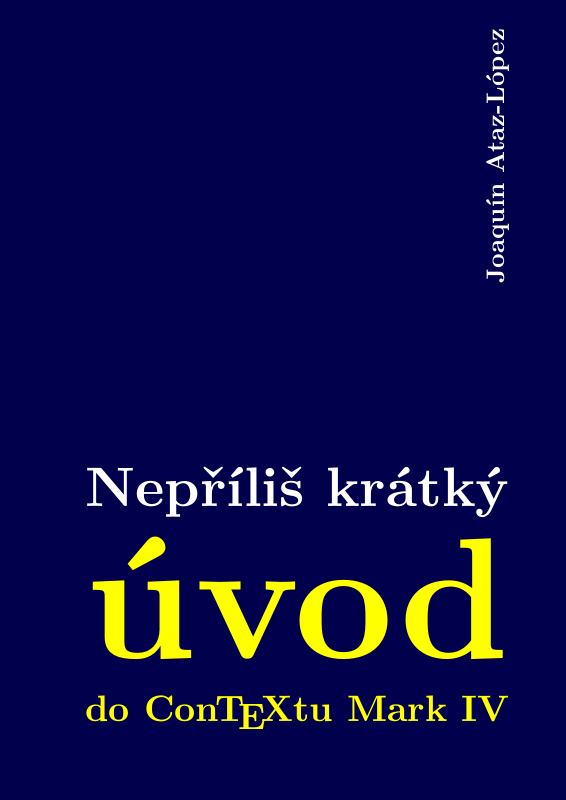
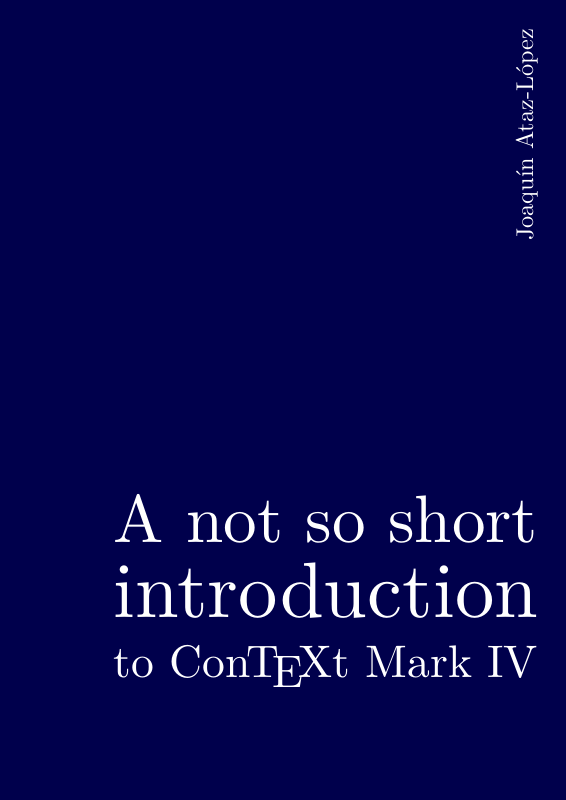
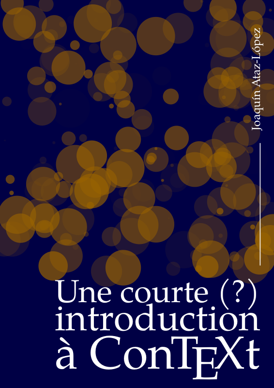
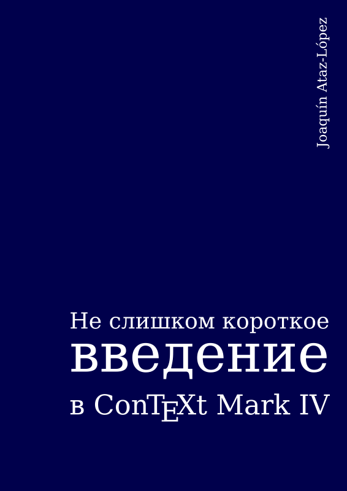
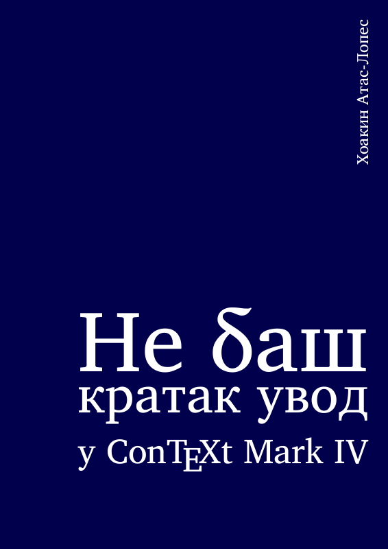
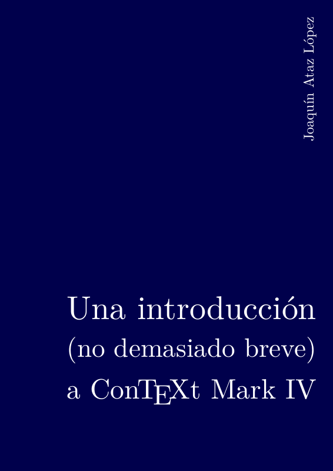
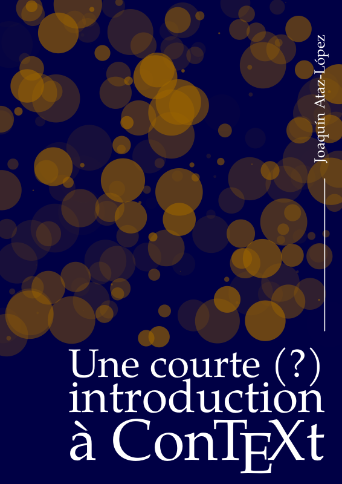

# A not so short introduction to ConTeXt

It can sometimes be useful to **help someone get started** with the 
**wonderful and fascinating typesetting and document composition system** that is [**ConTeXt**](https://wiki.contextgarden.net).

**There is not much literature to help you get into it, hence my initiative.**

The problem is that I've only been using ConTeXt for a short time and still 
have many doubts, so it's possible that the introduction may contain 
errors. 

Initially written in Spanish, this document interested several people, and in 
order to increase the potential audience, a member of the [ntg-context mailing list]( https://mailman.ntg.nl/pipermail/ntg-context/)
(native English speaker, who wishes to remain anonymous) has proceeded to translate my text into English.

| [Czech - Česky     v1.6](cs/introCTX_cs.pdf)                         | [English           v1.6](en/introCTX_eng.pdf)                        | [French - Français v1.6](fr/introCTX_fra.pdf)                        |
|----------------------------------------------------------------------|----------------------------------------------------------------------|----------------------------------------------------------------------|
|     |    |    |

| [Russian - Русский v1.6](ru/introCTX_rus.pdf)                        | [Serbian - Српски  v1.6](sr/introCTX_srb.pdf)                        | [Spanish - Español v1.6](es/introCTX_esp.pdf)                        |
|----------------------------------------------------------------------|----------------------------------------------------------------------|----------------------------------------------------------------------|
|    |    |    |

| [French v2.0alpha](fr2/introCTX_fra.pdf)                             |
|----------------------------------------------------------------------|
|  |

## Author

- Author : **©2020–2021, Joaquín Ataz-López**
- Original title: **Una introducción (no demasiado breve) a ConTeXt MarkIV**
- English Translation: A good friend who wishes to remain anonymous.

## Licence

The author of this text (and its English translator) authorises its
free distribution and use, including the right to copy and
redistribute this document in digital format on condition that its
authorship is acknowledged, and that it is not included in any
software package or suite, or in documentation whose conditions of
use or distribution do not include the free right of recipients to
copy and distribute.  Authorisation is likewise given for
translation of the document, provided that the authorship of the
original text is indicated, and that the translated text is
distributed under the FDL licence of the *Free Software
Foundation*, the *Creative Commons* licence that authorises
copying and redistribution, or a similar licence.

The above notwithstanding, publication or marketing or translation
of this document in paper form will require the author's express
authorisation in writing.

It is not a totally free licence since it does not allow it to be
marketed in paper form. The point is to prevent some "smartass"
from publishing this document as a book. However, apart from this
restriction, I believe that the licence continues to reflect quite
well the spirit of the FDL licence, in considerably less space.

## Version history:

- August 18, 2020: Version 1.0  (Spanish only) 
  - Original document.
- August 23, 2020: Version 1.1  (Spanish only)
  - Correction of minor errors, typos and misunderstandings by the author.
- September 3, 2020: Version 1.15 (Spanish only) 
  - More errors, typos and misunderstandings.
- September 5, 2020: Version 1.16 (Spanish only) 
  - More errors, typos and misunderstandings as well as some very minor changes to make the text clearer (I hope).
- September 6, 2020: Version 1.17 (Spanish only) 
  - The number of minor errors I am finding is incredible. I would just need to stop re-reading the document to find no more!
- October 21, 2020: Version 1.5  (Spanish only)
  - Introduction of suggestions and correction of errors reported by NTG-context users.
- January 2, 2021: Version 1.6
  - Corrections suggested after a new and careful reading of the document, on the occasion of its translation to English. This is the first version in English.
- July 4, 2021: Version 1.6
  -  1.6 version translated to French
  -  additionnal content, updated layout, reorganized source code only available in French
- July 31, 2021: Version 2.0alpha  (French only) 
  - Global reorganization of the content. Attention: the content still needs to be reviewed and adapted to fit this new reorganization.
- December 13, 2021: Version 1.6
  - Version 1.6 translated to Serbian

## Communication history

- August 18, 2020:  [ES-TEX Archives](https://listserv.rediris.es/cgi-bin/wa?A2=ind2008&L=ES-TEX&P=24771)
- October 14, 2020: [ntg-context Archives](https://mailman.ntg.nl/pipermail/ntg-context/2020/thread.html#99759)
- January 3, 2021:  [ntg-context Archives](https://mailman.ntg.nl/pipermail/ntg-context/2021/thread.html#100880)

## Evolutions

The original idea of this repository was to provide a platform that would allow 
different collaborators to translate the text into different languages. 
Whether or not git is the best solution for that purpose, I really don't 
know. **What I would appreciate is a guide on "how to set up a documentation 
translation project with git?" or any other solution which may more appropriate**.

### Principles

I would appreciate, of course, any suggestions for improvement.

The document is free
and anyone who wants to include it in any ConTeXt distribution can, of course, do so. 
Also, if anyone wants the source files, I have no problem providing them: that's why this git repository was set up.

I have not based my introduction on LMTX
because I think that for beginners a more stable system, like LuaTeX, is preferable.

I could eventually clarify any doubt that the various translators 
had about the meaning of the original. It should also be taken into 
account that in the original there are some fragments or examples 
designed for a Spanish cultural field that, outside it, do not make much 
sense. In this regard, the English translation has the merit of adapting 
these fragments (instead of translating them) or deleting them, as the 
case may be.

What I don't think is to coordinate the repository: I have never worked 
on collective projects and I hardly know how github works.

Having a repository can be useful to keep a version that is always up to 
date; but that, on the other hand, would force me to be continually 
modifying the text, which in principle is not my intention. I do not 
exclude that there will be other versions in the future, but for the 
moment this is not part of my plans. 

### Ideas for future content

And if there were other versions, 
it would be more to add some chapter; mainly I think that
**the most important material that is missing is the one related to XML, Lua and Metapost**, 
that is: the three additional languages in which a ConTeXt document can be written. 

But I am far from being able to write anything 
about any of those three aspects. Some member of the [ntg-context mailing list]( https://mailman.ntg.nl/pipermail/ntg-context/) has offered to 
help me with it, but not immediately (we all have a lot of work).

GarulfoPR trial done
